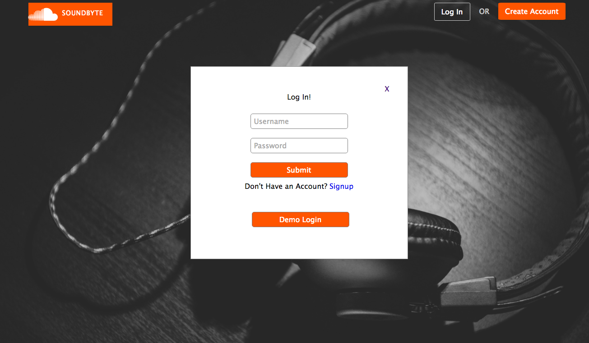
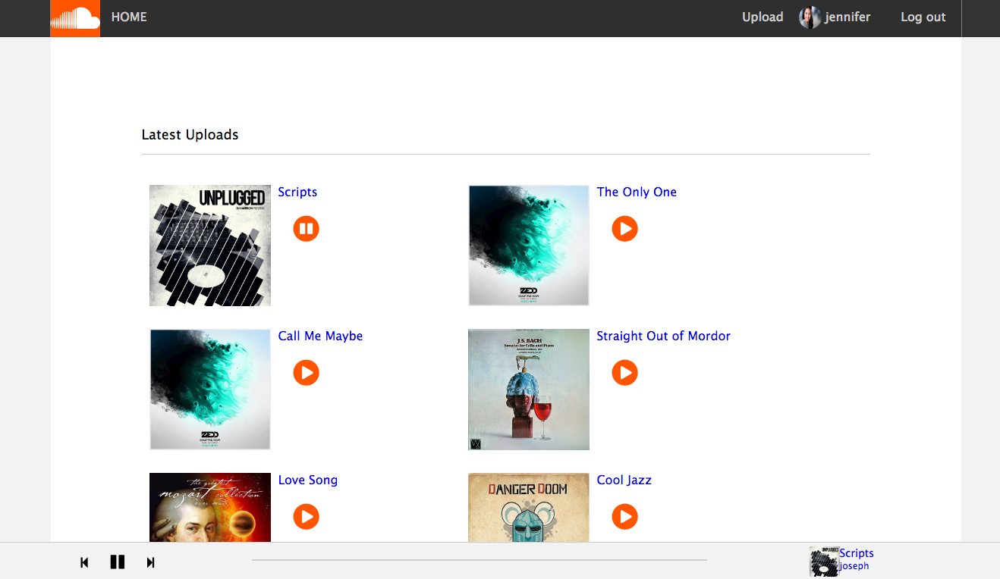
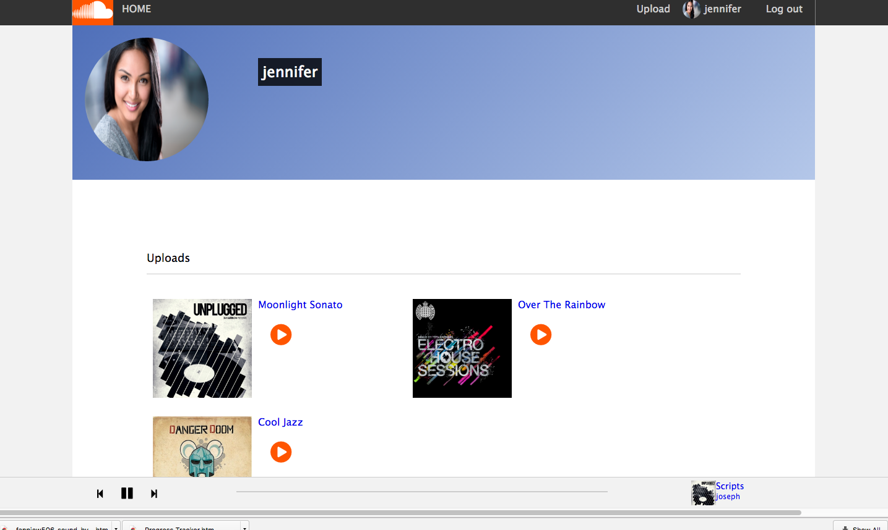
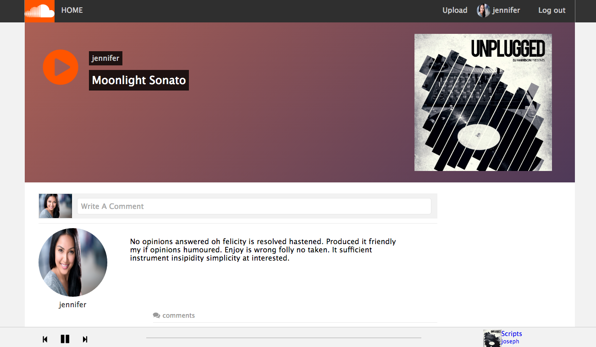

# SoundByte

SoundByte music upload sharing and streaming web application inspired by SoundCloud(http://wwww.soundcloud.com) created by Fannie Wang. It features recipes that users can save to their recipe box, rate, comment on, and more. Take a look at it live at [http://www.soundbytestreaming.com](http://www.soundbytestreaming.com) — you can log in on an already registered account with one click using the demo button.

[Live Here][live]

[live]: http://www.soundbytestreaming.com

## Features

* Authentication
  * Session is authenticated in the backend. All queries return data that corresponds to the proper user.
  * User can log in from any page in the app. Clicking on a link to save a recipe, access recipe box, etc. prompt the user for log in (as on the original app).
* Save recipes
* Mark recipes as cooked
* Comment on recipes
* Find recipes by tag
* Look at recipe boxes of other users

## Code Guide

If you'd like to take a closer look at the code behind the Cookbook App, the best folders to look in are:

* [sound_byte.jsx](./frontend/sound_byte.jsx)
* [React components](./frontend/components/)
  * [App](./frontend/components/app.jsx)
* [Rails controllers](./app/controllers/api)
* [Redux Stores](./frontend/store/store.js)
* [Api Utils](./frontend/util/)
* [DB Schema](./db/schema.rb)
* [Rails Routes](./config/routes.rb)

## Languages, Frameworks, Libraries, Etc.

* Ruby on Rails
* PostgreSQL
* React
* Redux
* jQuery
* Gems
  * Paperclip
  * pg_search
  * jwt
  * Jbuilder
  * BCrypt

## Screenshots

Home page:

Logged In Home Page:

Profile page:

Track page:

